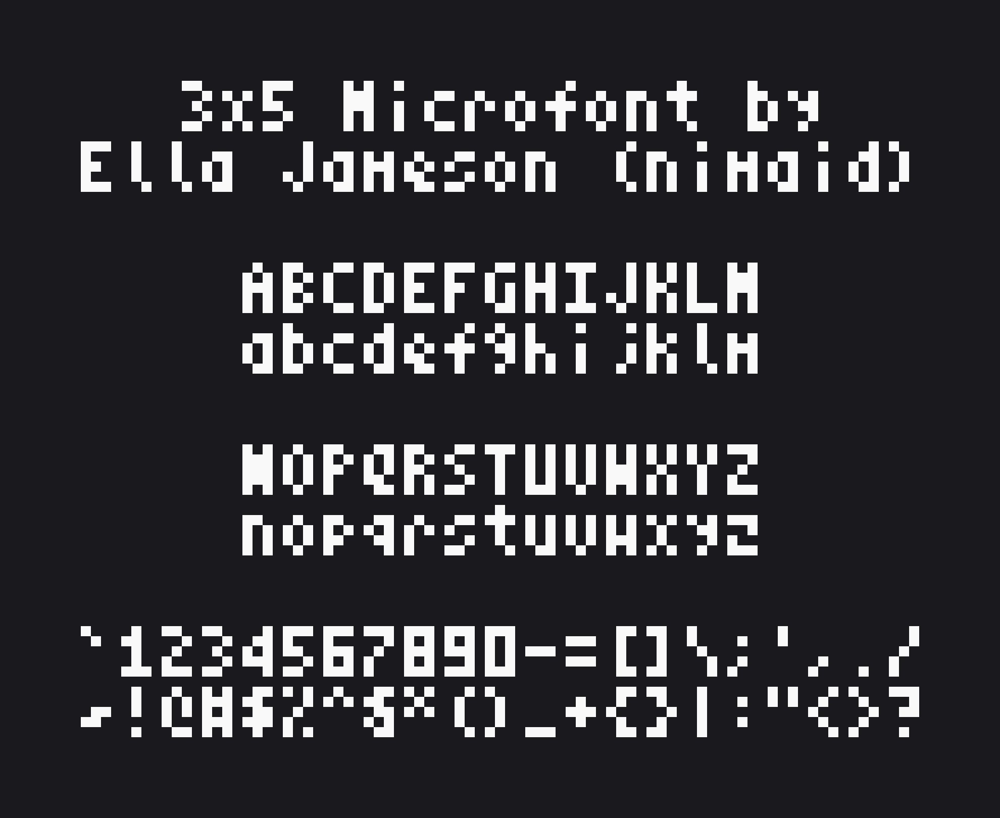
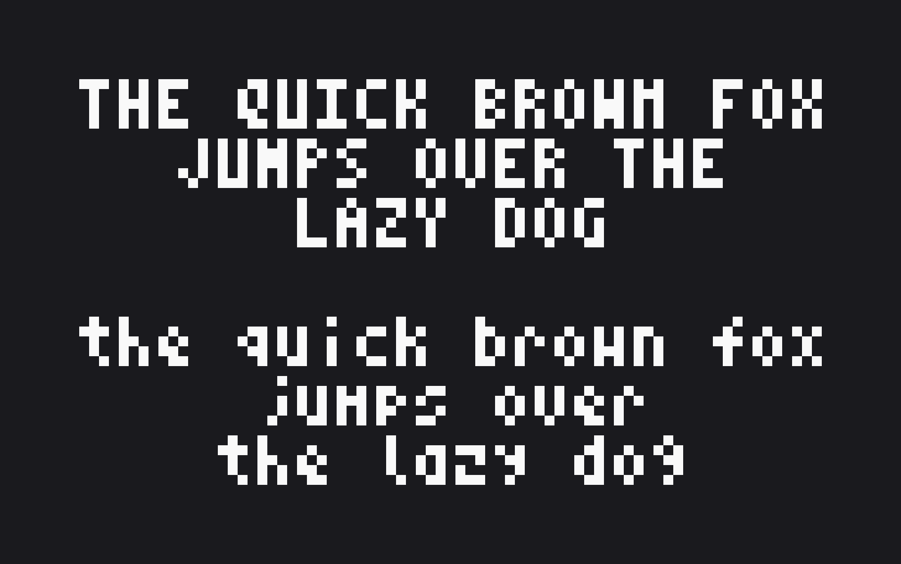
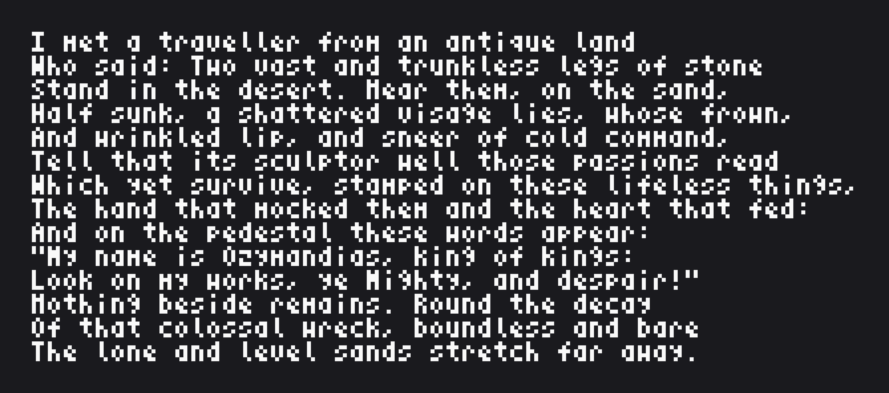
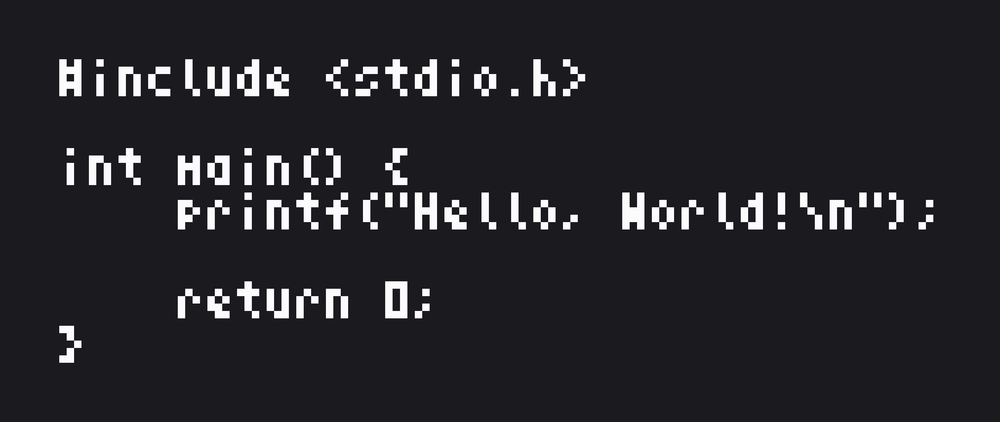
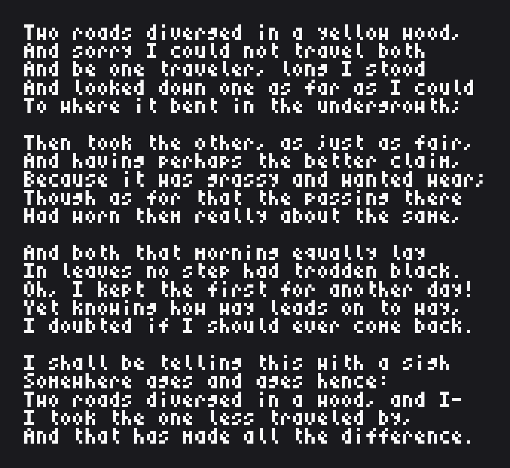
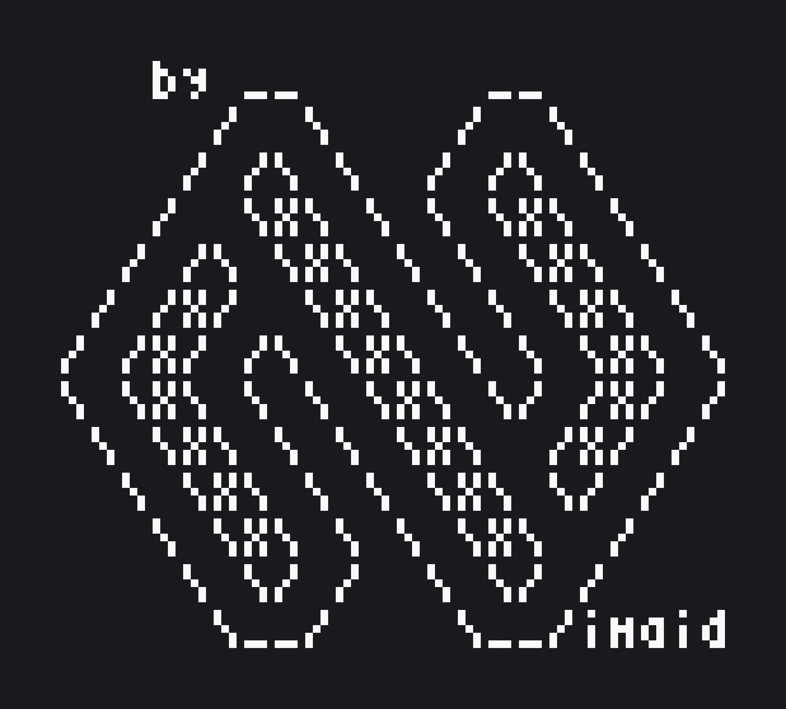

<h1 align="center">3x5 Microfont</h1>
<p align="center">A Highly Legible 3x5 Pixel Font With Full ASCII Support</p>

<p align="center"></p>

<p align="center"><a href="https://nimaid.itch.io/microfont">Itch.io Page</a></p>

## Examples
<details>

<summary>Sample Images</summary>

<br />

<p align="center">The classic pangram about a quick brown fox.</p>
<p align="center"></p>

<br />

<p align="center">The poem &quot;Ozymandias&quot; by Percy Bysshe Shelley.</p>
<p align="center"></p>

<br />

<p align="center">A standard &quot;Hello, World!&quot; program written in C.</p>
<p align="center"></p>

<br />

<p align="center">The poem &quot;The Road Not Taken&quot; by Robert Frost.</p>
<p align="center"><p align="center"></p>

<br />

<p align="center">ASCII art of my logo.</p>
<p align="center"><p align="center"></p>

</details>

## Bitmap Fonts (Sprite Sheets)
Two different formats of bitmap font are provided:
- `Microfont_1D` is a simple format that has one long row of all `128` ASCII characters laid out left-to-right.
  - [`Microfont_1D.png`](https://raw.githubusercontent.com/nimaid/microfont/refs/heads/main/Microfont_1D.png) (transparent)
  - [`Microfont_1D.bmp`](https://raw.githubusercontent.com/nimaid/microfont/refs/heads/main/Microfont_1D.bmp) (1-bit black-and-white)
- `Microfont_2D` is a more complex format that has the `128` ASCII characters laid out in `8` rows of `16`. They are laid out left-to-right, top-to-bottom (like English text).
  - [`Microfont_2D.png`](https://raw.githubusercontent.com/nimaid/microfont/refs/heads/main/Microfont_2D.png) (transparent)
  - [`Microfont_2D.bmp`](https://raw.githubusercontent.com/nimaid/microfont/refs/heads/main/Microfont_2D.bmp) (1-bit black-and-white)

<br />
<details>

<summary>How To Use The Sprite Sheets</summary>

### Calculating Glyph Position

The layout of the sprite sheets has been optimized to make converting from an ASCII character code to X and Y coordinates extremely simple.

All characters are `3` pixels wide by `5` pixels tall. The X and Y coordinates calculated below are for the **top left corner** of the desired glyph. So the full bounding box for any glyph is:
```
left = x
right = x + 3
top = y
bottom = y + 5
```

### 1D Calculations
These calculations work for `Microfont_1D.png` and are probably the simplest to do. The X coordinate is directly related to the full ASCII character code.

```
x = get_ascii_code(character) * 3
y = 0
```

### 2D Calculations
These calculations work for `Microfont_2D.png`. While they are slightly more complex, they allow for the sprite sheet to be a more reasonable aspect ratio. The X coordinate is based on the low nibble of the character code and the Y coordinate is based on the high nibble.

```
x = (get_ascii_code(character) & 0b1111) * 3
y = (get_ascii_code(character) >> 4) * 5
```

</details>

## Vector Fonts (TrueType / WOFF / WOFF2)
Thanks to the freeware program [PixelForge](https://www.pixel-forge.com/), I was able to create two different versions of this bitmap font in `.ttf` format! And thanks to [fontTools for Python](https://pypi.org/project/fonttools/), I was able to convert those into `.woff` and `.woff2` fonts, which are more suitable for web usage.

Two different font styles are provided:
- The `Microfont-Mono` font is a truly faithful recreation of the monospaced results you would normally get using this font programmatically from the sprite sheet.
  - [`Microfont-Mono.ttf`](https://raw.githubusercontent.com/nimaid/microfont/refs/heads/main/Microfont-Mono.ttf)
  - [`Microfont-Mono.woff2`](https://raw.githubusercontent.com/nimaid/microfont/refs/heads/main/Microfont-Mono.woff2)
  - [`Microfont-Mono.woff`](https://raw.githubusercontent.com/nimaid/microfont/refs/heads/main/Microfont-Mono.woff)
- The `Microfont` font is a version that is not monospaced, which may be desirable for graphic design and general text rendering.
  - [`Microfont.ttf`](https://raw.githubusercontent.com/nimaid/microfont/refs/heads/main/Microfont.ttf)
  - [`Microfont.woff2`](https://raw.githubusercontent.com/nimaid/microfont/refs/heads/main/Microfont.woff2)
  - [`Microfont.woff`](https://raw.githubusercontent.com/nimaid/microfont/refs/heads/main/Microfont.woff)

<br />
<details>

<summary>How To Use The Vector Fonts</summary>

### Optimal Text Sizes
Because the height of the characters is `5` pixels with `1` pixel between rows, PixelForge recommends using multiples of `6pt @ 96 DPI` for best results. In theory, that should render the font pixel-perfectly without antialiasing. 

However, in practice this behavior actually occurs at multiples of `8pt @ 96 DPI`. I don't know why this is, I can only assume it's a bug with PixelForge.

**So, for best results, use the following settings:**
- 1x - `8pt @ 96 DPI`
- 2x - `16pt @ 96 DPI`
- 3x - `24pt @ 96 DPI`
- 4x - `32pt @ 96 DPI`
- 5x - `40pt @ 96 DPI`
- 6x - `48pt @ 96 DPI`
- ... etc.


### Web Usage
You can add these fonts for use on a webpage by including the following code in your CSS stylesheet:
```css
@font-face {
  font-family: 'Microfont';
  src: url('https://raw.githubusercontent.com/nimaid/microfont/refs/heads/main/Microfont.woff2') format('woff2');
  src: url('https://raw.githubusercontent.com/nimaid/microfont/refs/heads/main/Microfont.woff') format('woff');
  src: url('https://raw.githubusercontent.com/nimaid/microfont/refs/heads/main/Microfont.ttf') format('truetype');
  font-weight: normal;
  font-style: normal;
  font-display: swap;
}

@font-face {
  font-family: 'Microfont-Mono';
  src: url('https://raw.githubusercontent.com/nimaid/microfont/refs/heads/main/Microfont-Mono.woff2') format('woff2');
  src: url('https://raw.githubusercontent.com/nimaid/microfont/refs/heads/main/Microfont-Mono.woff') format('woff');
  src: url('https://raw.githubusercontent.com/nimaid/microfont/refs/heads/main/Microfont-Mono.ttf') format('truetype');
  font-weight: normal;
  font-style: normal;
  font-display: swap;
}
```

</details>

## Direct Encodings
Thanks to [slaimon](https://github.com/slaimon) and his converter script `src/encode_binary_array.py`, you can now directly store this font in a simple array of binary numbers. Because each character is only `15` pixels total, they fit well into a `16`-bit word. The number representing an ASCII character's glyph is indexed by that ASCII character's code.

Here is that array for the current iteration of the Microfont:
```
{
    0x0000, 0x0000, 0x0000, 0x0000, 0x0000, 0x0000, 0x0000, 0x0000,
    0x0000, 0x0000, 0x0000, 0x0000, 0x0000, 0x0000, 0x0000, 0x0000,
    0x0000, 0x0000, 0x0000, 0x0000, 0x0000, 0x0000, 0x0000, 0x0000,
    0x0000, 0x0000, 0x0000, 0x0000, 0x0000, 0x0000, 0x0000, 0x0000,
    0x0000, 0x2482, 0x5a00, 0x5f7d, 0x3cfa, 0x52a5, 0x3ceb, 0x2400,
    0x1491, 0x4494, 0x5540, 0x05d0, 0x0014, 0x01c0, 0x0002, 0x12a4,
    0x7b6f, 0x2c97, 0x62a7, 0x628e, 0x1779, 0x798e, 0x79ef, 0x72a4,
    0x7bef, 0x7bcf, 0x0410, 0x0414, 0x1511, 0x0e38, 0x4454, 0x72c2,
    0x2b63, 0x2bed, 0x6bae, 0x3923, 0x6b6e, 0x79a7, 0x79a4, 0x396b,
    0x5bed, 0x7497, 0x126a, 0x5bad, 0x4927, 0x5fed, 0x5ffd, 0x2b6a,
    0x6ba4, 0x3b73, 0x6bad, 0x388e, 0x7492, 0x5b6f, 0x5b6a, 0x5bfd,
    0x5aad, 0x5a92, 0x72a7, 0x3493, 0x4889, 0x6496, 0x2a00, 0x0007,
    0x4400, 0x076b, 0x4d6e, 0x0723, 0x176b, 0x0573, 0x15d2, 0x07ce,
    0x49ad, 0x2092, 0x2094, 0x4bad, 0x2491, 0x0bed, 0x0d6d, 0x056a,
    0x0d74, 0x0759, 0x0564, 0x070e, 0x2691, 0x0b6b, 0x0b6a, 0x0b7d,
    0x0a95, 0x0aca, 0x0e67, 0x3513, 0x2492, 0x6456, 0x00f0, 0x0000
}
```

<br />
<details>

<summary>How To Use The Binary Array</summary>

### Decoding The Binary Array
To learn how to decode each glyph, see the `decode_glyph_from_binary()` function in `src/modules/common.py`.

To learn how to use the decoded glyph bitmap arrays, see the `print_bitmap()` function.

</details>

## Scripts
This project has helper scripts to assist me in converting to the various formats when I need to update everything. 

All the functionality of these scripts is stored in `src/modules/common.py`, all the defaults are stored in `src/modules/defaults.py`, and the argument parsers are stored in `src/modules/parsers.py`.

Each script file listed below is a simple wrapper for functions and values defined in the above files.

These scripts require [Python 3](https://www.python.org/) to be installed. Additionally, the following packages must installed via pip:
```bash
pip install Pillow fontTools brotli
```

### Image Generators
I have included two Python scripts named `src/generate_1D.py` and `src/generate_2D.py`. I used these to generate the example images.

Both are tools with a command line interface that render text into images using a sprite sheet, however:
- `src/generate_1D.py` uses `Microfont_1D.png`
- `src/generate_2D.py` uses `Microfont_2D.png`

To see the key differences between using the 1D and 2D sprite sheet, open `src/modules/common.py` and compare the following functions:
- `validate_image_font_1d()` / `validate_image_font_2d()`
- `image_font_char_size_1d()` / `image_font_char_size_2d()`
- `get_glyph_position_1d()` / `get_glyph_position_2d()`

You can see how to use the scripts with:
```bash
python src/generate_1D.py --help
python src/generate_2D.py --help
```

### Binary Array Converter
To see how to use the script used to encode the font into a binary array:
```bash
python src/encode_binary_array.py --help
```
